<!--

**Hyochan02/Hyochan02** is a ✨ _special_ ✨ repository because its `README.md` (this file) appears on your GitHub profile.

-->
# 안녕하세요, 프론트엔드 개발자 진효찬입니다👋
👋 안녕하세요, 사용자 경험과 자연스러운 흐름에 관심이 많은 프론트엔드 개발자 진효찬입니다.  
보이는 대로 구현하기보다 "왜 이렇게 동작해야 할까"를 한 번 더 고민하며 만드는 편이에요. 😎

## 📞 Contacts

## 💪 Skills

**💻 Languages & Frameworks**

 

 

**🛠️ Tools & Collaborations**

 

 

 

<a href="https://github.com/devxb/gitanimals">

</a>

